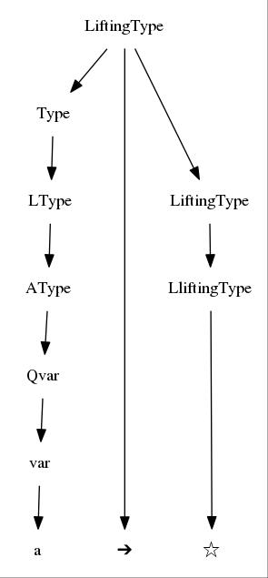

# Cedille Parser [](https://travis-ci.org/ernius/cedilleparser)

Dependant typed programming language (called Cedille) parser.

## Must review:

* Reserved words: **import**, **module**, **as**, **let**, **in** and other several symbols.

* White spaces treatment. Avoid spaces treatment in the grammar, discarding them in the lexical phase.

* Some associations grammar disambiguation in terms application and arrow operator in kinds.

For example the following term production rules:

```
aterm -> aterm ws maybeErased aterm .

maybeErased -> .
maybeErased -> '-' ows 
```
are replaced by:

```
Aterm ->  Aterm     Lterm
Aterm ->  Aterm '-' Lterm
```

So terms applications explicitly associates from left to right. Notation: names of grammar variables begin with uppercase, while tokens begin with lowercase or are quoted. Another change implied by the last rule, is that the left `aterm` and the `'-'` symbols could produce strings without any white spaces between the strings generated by them (equivalent to a rule `aterm -> aterm` **ows** `maybeErased aterm`)

Another example of associations disambiguation, now in kinds, is the following:

```
kind -> kind ows '➔' ows kind
```

is replaced by:

```
Kind -> LKind '➔' Kind
```

So arrow symbol associates explicitly from right to left.

Theses operators precedences could also be reproduced by the use of Happy Context-Dependent Operator Precedence mechanism, but to keep the grammar more similar to the original one this mechanism is not applied.
   
* Because of a **reduce/reduce conflict** with variables and holes in types and terms I added brackets to terms equality type syntax. That is, the following rule:

```
Type -> Term '≃' Term
```

is replaced by:

```
Type -> '{' Term '≃' Term '}'
```
  
* Position information should be converted into a string and verified.

* Verification of the generated AST against previous parser.

* There exist three **shift/reduce conflicts**. Two of them are problematic, and are related with the LiftingType rules (specifically with `LiftingType -> Type '➔' LiftingType` rule). Next is detailed a problematic example. First I show the shift/reduce conflict in the state 12 of the generated parser (extracted from file [src/CedilleParser.info](src/CedilleParser.info)).

```
State 12

        ...
	Type -> LType . '➔' Type                           (rule 74)
	Type -> LType .                                     (rule 75)
        ...
	
	'➔'            shift, and enter state 116
			(reduce using rule 75)
```

The input `Π a : a . a ➔ ☆` can be generated by LiftingType rules, as shown in next figure.



But due to previous shift/reduce conflict it is not parsed. Next is the output of the parser run in debug mode for this input:

```
state: 6,	token: 37,	action: shift, enter state 22
state: 22,	token: 1,	action: shift, enter state 70
state: 70,	token: 36,	action: reduce (rule 105), goto state 107
state: 107,	token: 36,	action: shift, enter state 135
state: 135,	token: 1,	action: shift, enter state 17
state: 17,	token: 28,	action: reduce (rule 106), goto state 16
state: 16,	token: 28,	action: reduce (rule 83), goto state 13
state: 13,	token: 28,	action: reduce (rule 81), goto state 141
state: 141,	token: 28,	action: reduce (rule 75), goto state 201
state: 201,	token: 28,	action: shift, enter state 209
state: 209,	token: 1,	action: shift, enter state 17
state: 17,	token: 49,	action: reduce (rule 106), goto state 16
state: 16,	token: 49,	action: reduce (rule 83), goto state 13
state: 13,	token: 49,	action: reduce (rule 81), goto state 12
state: 12,	token: 49,	action: shift, enter state 116
state: 116,	token: 53,	action: fail.
state: 116,	token: 0,	action: fail.
```

In the state 12 the generated parser reads the arrow symbol as part of a Type (`Type -> LType . '➔' Type` rule (74)) and not of a LiftingType rule (applying a reduce with `Type -> LType` rule (75)).

* Export parser to Agda
  ** Exported haskell AST datatype to agda [doc/cedille-types.agda](doc/cedille-types.agda) and also the parser (next fragment)

```
{-# IMPORT CedilleParser #-}

data Either (A : Set)(B : Set) : Set where
  Left : A → Either A B
  Right : B → Either A B
{-# COMPILED_DATA Either Either Left Right #-}

postulate
  parseStart : string → Either string start

{-# COMPILED parseStart CedilleParser.parseTxt #-}
```
  

